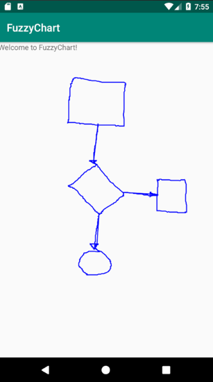

#CS683 Project Assignment - Iteration 1: Project Assignment
###Project Name: FuzzyChart - Student: Xander Le
--------------
## 1. Overview

*(Please give an overview of your project. It should include the motivation, the purpose and the potential users of the proposed application. This can be the same as in your previous document. If you change it from the last iteration, please make a note.)*

* NOTE: The Overview has not changed from the previous assignment and is just restated here.

My app will be a flowcharting program called FuzzyChart which will allow the user to draw flowcharting diagrams by drawing basic shapes and connecting them together. The user will be able to input shapes by drawing them freehand and having the app transform them to the closest matching geometric shapes (circles, squares, triangles, etc.).

The purpose of this app is to provide a simple way to quickly capture design ideas for a software program or any engineering project that might benefit from having a flow diagram. Potential users of this app are software developers, system designers and analysts, engineers, and anyone who simply wants to quickly sketch out their ideas for their project using a flow diagram.

One of the main reasons I chose this application is so that I can utilize my knowledge of machine learning that I gained from the last class that I took. There I used machine learning to make a calculator app that accepted hand-written digits as input.

## 2. Requirement Analysis and Testing

*(For each requirement you have worked on in this iteration, please give a detailed description, completion status (completed, or partially completed) and show the testing results if completed or partially completed, such as screenshots of the application screens or log info. Please also specify if this requirement is a new requirement or a requirement you had started in previous iterations.)*

The following requirements are being worked on for this iteration:

1. **Requirement E1 - Hand-drawn Shapes:** (This is a previously-stated requirement.) The app shall accept hand-drawn shapes input from the user.
	* **Status:** Almost completed.
	* **Description:** The code to input hand-drawn shapes has been created and tested, and works correctly for this iteration. There is no interpretation or translation of these shapes at this stage.
	* **Results:** The following is a screenshot showing several shapes that have been drawn by hand:
	* 
2. **Requirement E2 - Shape Recognition:** (This is a previously-stated requirement.) Right after each shape is drawn, the app shall interpret and translate it to the geometric shape that most closely matches it, then replace the hand-drawn shape with the translated shape. At a minimum the app will recognize the following six geometric shapes: circle, oval, square, rectangle, triangle, diamond.
	* **Status:** In process.
	* **Description:** Currently experiments are being done with TensorFlow[1] for Android code. I have used TensorFlow in a previous project, and I am finding that it is much different for Android. I will need to do further experiments and testing before I can get it to work properly.
	* **Results:** The TensorFlow code does not currently work and is still being tested.

## 3. Design and Implementation

(Please describe Android components and features you have used in this iteration to implement the above requirements in your application. For each feature you used, provide a brief description and supporting evidences, such as sample code, log info, or screenshot(s) of execution results. Please specify mapped requirements and files in your project.)

Android components used in this iteration:

1. **Activities:** There is one activity in this iteration: `MainActivity`, which uses a layout file named `activity_main.xml`. This layout uses a custom view created in a Java class named `DiagramView.java` where the drawings are made. The Activities component maps to the E1 and E2 requirements in this iteration. The code for `MainActivity` is shown here:

		package edu.bu.metcs.fuzzychart;
		
		import androidx.appcompat.app.AppCompatActivity;
		import android.os.Bundle;
		import android.widget.LinearLayout;
		
		public class MainActivity extends AppCompatActivity {
		
		    @Override
		    protected void onCreate(Bundle savedInstanceState) {
		        super.onCreate(savedInstanceState);
		        setContentView(R.layout.activity_main);
		        LinearLayout linearLayout = findViewById(R.id.linearLayout);
		        linearLayout.addView(new DiagramView(this));
		    }
		}
	
	A sample of the code in `DiagramView.java` is shown here:
	
		package edu.bu.metcs.fuzzychart;
		
		import android.content.Context;
		...
		import android.view.View;
		
		public class DiagramView extends View {
		    Paint paint;
		    Path path;
		
		    public DiagramView(Context context) {
		        super(context);
		        path = new Path();
		        paint = new Paint();
		        ...
		    }
		
		    public boolean onTouchEvent(MotionEvent event) {
		        super.onTouchEvent(event);
		        switch (event.getAction()) {
		            case MotionEvent.ACTION_DOWN: {
		                path = new Path();
		                Point p = new Point((int) event.getX(), (int) event.getY());
		                path.moveTo(p.x, p.y);
		                invalidate();
		                break;
		            }
		            case MotionEvent.ACTION_MOVE: {
		                Point p = new Point((int) event.getX(), (int) event.getY());
		                path.lineTo(p.x, p.y);
		                invalidate();
		                break;
		            }
		            case MotionEvent.ACTION_UP: {
		                path.close();
		                break;
		            }
		        }
		        return true;
		    }
		
		    @Override
		    protected void onDraw(Canvas canvas) {
		        super.onDraw(canvas);
		        canvas.drawPath(path, paint);
		    }
		}
	
2. **Graphics:** Graphics are in all phases and requirements for this project. The main function that Android uses to render all graphics is `onDraw()`, as shown below (and in the `DiagramView.java` code above). This method is called by the system whenever a graphics element needs to be rendered, as when it is first created or has subsequently been changed. The actual graphics elements themselves are created elsewhere, as shown in the `onTouchEvent()` method in the `DiagramView.java` code above. This code contains calls to `invalidate()` in several places; whenever this method gets called it tells the system that graphics need to be updated, resulting in it calling the `onDraw()` method.

	    @Override
	    protected void onDraw(Canvas canvas) {
	        super.onDraw(canvas);
	        canvas.drawPath(path, paint);
	    }

##4. Project Structure

(Please provide a screenshot(s) of your project structure, which should show all the packages, java files and resource files in your project. You should also highlight any files/packages you have changed, added/deleted in this iteration comparing with the previous iteration).

The following shows a screenshot of the project structure for this iteration, with all relevant folders and files shown:

## 5. Timeline

*(Please provide a detailed plan/description to specify when the above requirements and android features will be/are implemented. This should be updated in every iteration.)*

|Iteration | Application Requirements (E/D/O) | Android Components and Features| 
|---|---|---|
|1|E1 and E2|Activities, Graphics, Machine Learning, Multithreading |
|2|E2, E3 and E4|Activities, Graphics, Machine Learning, Multithreading|
|3|E5 and E6|Activities, Graphics, Multithreading|
|4|D1 to D3|Activities, Graphics, Multithreading, Files|
|5|O1 to O5 *(As many of these will be implemented as time permits.)*|Activities, Graphics, Multithreading|

## 6. References

*(Please list all your references here)*

[1] [TensorFlow for Android](https://www.tensorflow.org/lite/guide/android)