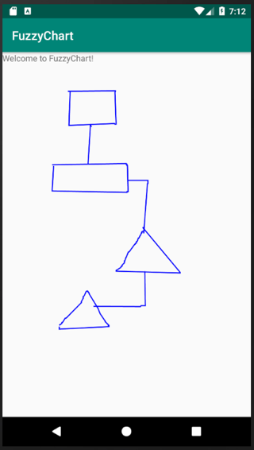
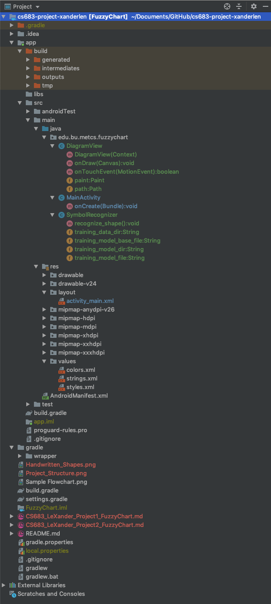

#CS683 Project Assignment - Iteration 2: Project Assignment
###Project Name: FuzzyChart - Student: Xander Le
--------------
## 1. Overview

*(Please give an overview of your project. It should include the motivation, the purpose and the potential users of the proposed application. This can be the same as in your previous document. If you change it from the last iteration, please make a note.)*

* NOTE: The Overview and requirements have not changed since last assignment, but there is an update to this as noted in the UPDATE below.

My app will be a flowcharting program called FuzzyChart which will allow the user to draw flowcharting diagrams by drawing basic shapes and connecting them together. The user will be able to input shapes by drawing them freehand and having the app transform them to the closest matching geometric shapes (circles, squares, triangles, etc.).

The purpose of this app is to provide a simple way to quickly capture design ideas for a software program or any engineering project that might benefit from having a flow diagram. Potential users of this app are software developers, system designers and analysts, engineers, and anyone who simply wants to quickly sketch out their ideas for their project using a flow diagram.

One of the main reasons I chose this application is so that I can utilize my knowledge of machine learning that I gained from the last class that I took. There I used machine learning to make a calculator app that accepted hand-written digits as input.

* UPDATE: After working with TensorFlow, which is the Google machine learning API that I intended to implement, I found that it was very difficult and troublesome to implement, so I decided to use my own algorithms to interpret the hand-drawn shapes. This is explained in the section below.

## 2. Requirement Analysis and Testing

*(For each requirement you have worked on in this iteration, please give a detailed description, completion status (completed, or partially completed) and show the testing results if completed or partially completed, such as screenshots of the application screens or log info. Please also specify if this requirement is a new requirement or a requirement you had started in previous iterations.)*

The following requirements are being worked on for this iteration:

1. **Requirement E1 - Hand-drawn Shapes:** (This is a previously-stated requirement.) The app shall accept hand-drawn shapes input from the user.
	* **Status:** Completed.
	* **Description:** This part is largely completed.
	* **Results:** The following is a screenshot showing several shapes that have been drawn by hand. The has straightened the lines but not yet converted the input to standard shapes.
	* 
2. **Requirement E2 - Shape Recognition:** (This is a previously-stated requirement.) Right after each shape is drawn, the app shall interpret and translate it to the geometric shape that most closely matches it, then replace the hand-drawn shape with the translated shape. At a minimum the app will recognize the following six geometric shapes: circle, oval, square, rectangle, triangle, diamond.
	* **Status:** Partially completed.
	* **Description:** I have completely changed the algorithm for converting hand-drawn input into shapes. The reason for this is that the TensorFlow code I was trying to implement has not been working well and it was apparent it would require a lot more work to achieve success. It turns out that the TensorFlow API for Android, called TensorFlow Lite, is a bit different than TensorFlow for a desktop application. I was having a lot of trouble even getting it set up correctly. I believe that I could ultimately get it to work, but it would take too long and the project would not be completed in time.
	* **Results:** I am having a lot more success using my own algorithms to interpret shapes. I have implemented an algorithm to straighten out lines that performs well, and I am using this as a basis to classify and convert the standard shapes. I am now working on code to convert circles and ovals and believe this will work well also.

3. **Other requirements**: Because of the issues I was having with TensorFlow I have not been able to work on the other requirements yet; however now that I have pretty much solved this issue using my own algorithms I expect to be able to catch up on these shortly. 

## 3. Design and Implementation

(Please describe Android components and features you have used in this iteration to implement the above requirements in your application. For each feature you used, provide a brief description and supporting evidences, such as sample code, log info, or screenshot(s) of execution results. Please specify mapped requirements and files in your project.)

Android components used in this iteration:

1. **Activities:** I have been working on code in the Main Activity that accepts and interprets the hand-drawn images. Shown below is some of the relevant parts of this code with comments explaining what they do:

		class ShapeRecognizer {
		    private static ShapeRecognizer shapeRecognizer;
		    ...
		    Shape recognizeShape(Shape shape) {
		        Shape recognizedShape = new Shape();
		        
				/*********************************************************************************  
				 * Check to see if there are more than three points that make up a shape; if not
				 * leave the shape as is, otherwise straighten out its lines. 
				/*********************************************************************************  
		        if (shape.vertices.size() <= 3) {
		            recognizedShape.vertices.addAll(shape.vertices);
		        } else {
		            double lineDirection;
		            Point firstPoint = shape.vertices.remove(0);
		            Point secondPoint = shape.vertices.remove(1);
		            lineDirection = getDirection(firstPoint, secondPoint);
					...	
					/*****************************************************************************
					 * Step through each of the points that makes up a shape and determine the 
					 * direction, in degrees, of the line segment connecting them. Adjacent line
					 * segments with slopes that are close to each other are combined into one
					 * segment.
					/*****************************************************************************
		            for (Point point : shape.vertices) {
		                double lineSegmentDirection = getDirection(previousPoint, point);
		                if (Math.abs(lineSegmentDirection - lineDirection) > 45) {
		                    recognizedShape.vertices.add(previousPoint);
		                    Log.e("Line Direction", String.valueOf(lineSegmentDirection));
		                    lineDirection = lineSegmentDirection;
		                }
		                previousPoint = point;
		            }
		            recognizedShape.vertices.add(previousPoint);
		        }
		        Shape temp_shape = shape;
		        return recognizedShape;
		    }
		    ...
		 }
	
	
2. **Graphics:** Graphics are in all phases and requirements for this project. The main function that Android uses to render all graphics is `onDraw()` as shown below. This method is called by the system whenever a graphics element needs to be rendered, as when it is first created or has subsequently been changed.

	    @Override
	    protected void onDraw(Canvas canvas) {
	        super.onDraw(canvas);
	        canvas.drawPath(path, paint);
	    }

##4. Project Structure

(Please provide a screenshot(s) of your project structure, which should show all the packages, java files and resource files in your project. You should also highlight any files/packages you have changed, added/deleted in this iteration comparing with the previous iteration).

The following shows a screenshot of the project structure for this iteration, with all relevant folders and files shown:

## 5. Timeline

*(Please provide a detailed plan/description to specify when the above requirements and android features will be/are implemented. This should be updated in every iteration.)*

|Iteration | Application Requirements (E/D/O) | Android Components and Features| 
|---|---|---|
|1|E1 and E2|Activities, Graphics, Multithreading |
|2|E2|Activities, Graphics, Multithreading|
|3|E3 to E6|Activities, Graphics, Multithreading|
|4|D1 to D3|Activities, Graphics, Multithreading, Files|
|5|O1 to O5 *(As many of these will be implemented as time permits.)*|Activities, Graphics, Multithreading|

## 6. References

*(Please list all your references here)*
