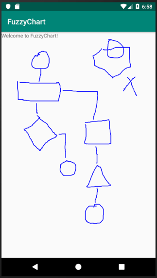
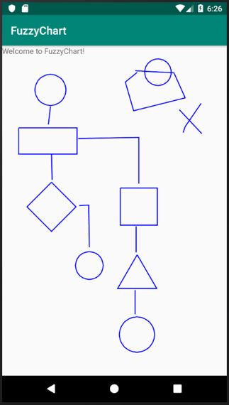

#CS683 Project Assignment - Iteration 3: Project Assignment
###Project Name: FuzzyChart - Student: Xander Le
--------------
## 1. Overview

*(Please give an overview of your project. It should include the motivation, the purpose and the potential users of the proposed application. This can be the same as in your previous document. If you change it from the last iteration, please make a note.)*

1. **Summary**

	The Overview and requirements have not changed since the last assignment and is summarized here. There has, however, been a major change in the model used to implement shape recognition; this is explained in **Model Changes** below.

	My app is a simple flowcharting program called FuzzyChart which takes hand-drawn shapes and transforms them to the closest matching standard geometric shapes (circles, squares, triangles, etc.). The purpose of this app is to provide a simple way to quickly capture design ideas; potential users are software developers, system designers and analysts, engineers, and anyone who simply wants to quickly sketch out their ideas using a flow diagram.

2. **Model Changes**

	One of the original reasons I choose this application is so that I could utilize my knowledge of machine learning that I acquired in previous courses. I had intended to use TensorFlow as the recognition engine for my shapes. However, I was not able to successfully get this to work in a timely manner, so I abandoned this idea in favor of using my own recognition algorithms, which does not use machine learning. I have now successfully implemented these algorithms as explained in the **Design and Implementation** section below.
	
	My new approach has taken some extra time to implement, but as of this iteration it is now complete, and I am now able to move on to the rest of the features. The new algorithm recognizes the following shapes: Circle, Square, Rectangle, Triangle, Diamond and Line.
	
## 2. Requirement Analysis and Testing

*(For each requirement you have worked on in this iteration, please give a detailed description, completion status (completed, or partially completed) and show the testing results if completed or partially completed, such as screenshots of the application screens or log info. Please also specify if this requirement is a new requirement or a requirement you had started in previous iterations.)*

The status of the requirements is as follows:

1. **Requirement E1 - Hand-drawn Shapes:** (This is a previously-stated requirement.) The app shall accept hand-drawn shapes input from the user.
	* **Status:** Completed.
	* **Description:** This has been tested and works correctly.
	* **Results:** Sample flowcharts are shown in the next section.
2. **Requirement E2 - Shape Recognition:** (This is a previously-stated requirement.) Right after each shape is drawn, the app shall interpret and translate it to the geometric shape that most closely matches it, then replace the hand-drawn shape with the translated shape. At a minimum the app will recognize the following six geometric shapes: circle, oval, square, rectangle, triangle, diamond.
	* **Status:** Completed.
	* **Description:** I have completely changed the algorithm for converting hand-drawn input into shapes, due to difficulties in implementing the TensorFlow APIs. The new algorithm does not use machine learning, but instead relies on traditional processing techniques as explained in the **Design and Implementation** section below.	
	* **Results:** Below are two screenshots of a flowchart - the first shows hand-drawn shapes with shape recognition turned off; the second shows the flowchart after shape recognition has been turned on and the shapes converted.
	*           

3. **Other requirements**: I am now able to devote the rest of my time to implementing the rest of the requirements. I anticipate that I will be able to implement all of the Essential Features and at least some of the Desirable Features for the final release.

## 3. Design and Implementation

(Please describe Android components and features you have used in this iteration to implement the above requirements in your application. For each feature you used, provide a brief description and supporting evidences, such as sample code, log info, or screenshot(s) of execution results. Please specify mapped requirements and files in your project.)

The main change I made in this iteration is the implementation of the shape recognition algorithms. The code for this is contained in a class called **`ShapeRecognizer`**. The top-level method used for recognizing a shape is called **`recognizeShape`**. This method and the other important ones used in the class are explained below:

1. **`Shape recognizeShape(Shape shape)`**

	This takes a **Shape** object, which consists of an **ArrayList** of **Points**, and passes it through two stages to transform it into one of these standard shapes: Circle, Square, Rectangle, Triangle, Diamond and Line. It constructs and returns a new **Shape** object containing the interpreted shape.
	
	The first stage calls the **simplifyShape** method that simplifies the **Shape** by reducing the number of extraneous points in it. The second stage passes the simplified shape to the **standardizeShape** method, which analyzes it, determines what type of shape it is, and generates an idealized **Shape** object, which is returned.
	
	If the recognized shape is a circle, the algorithm is complete and returns the **Shape**. If it is another type of shape it is presumed to be some type of polygon made up of straight lines. In this case it then passes through the two stages again after first changing some input factors that alters how the shape is processed. These changes will cause the **simplifyShape** method to give more weight to straight lines. The code for this is shown here:
	
	

2. **`Shape simplifyShape(Shape shape, ...factors...)`**

	This takes a **Shape** object and loops though all points in that object to reduce the total number of points by eliminating extraneous ones. It does this by analyzing the slopes of the line segments defined by the points and combining adjacent segments together that have similar slopes. The "similarity factor" is one of the input factors mentioned above. The result is returned in another **Shape** object; the input one is not modified.
	
3. **`Shape standardizeShape(Shape shape, ...factor...)`**

	This takes a **Shape** object and analyzes it to determine what standard shape it most closely matches. It does this mainly by analyzing the slopes and curvatures of the line segments, determining whether the shape is opened or closed (i.e., if the last point is close to the first point), and looking at the number of points in the **Shape**. Once it determines the type of shape, it then generates an idealized shape and puts it into the returned **Shape** object.
	
	The input shape can contain any set of points that defines the shape, but it works best with shapes that have first been processed and simplified with the **simplifyShape** method, as the results will be a lot more accurate. This is the reason for first processing a hand-drawn shape with the **simplifyShape** method.
	
4. **`String getClosedShapeType(Shape shape)`**

	This is a helper method used by the **standardizeShape** method to determine the type of a **Shape** after it has been determined that it is a closed shape and has the same curvature direction throughout. It will return a **String** containing one of the following: "Triangle", "Circle", "Diamond", "Square", "Horizontal Rectangle", "Vertical Rectangle", or "Polygon". "Polygon" is used when it cannot match the closed shape to any of the other shape types.
	
5. **`boolean shapeHasHomogeneousCurvature(Shape shape, ...factor...)`**

	This is another helper method used by the **standardizeShape** method to determine whether a closed shape has the same curvature throughout (i.e. not "bending" back and forth), which is one of the criteria used to decide if a shape is a properly-formed standard shape or not.
	
6. Other minor helper methods

	There are several other minor helper methods used by the above main methods; they are:
	
	**`double getPointsDistance(Point point1, Point point2)`** - Returns the distance between two points.
	
	**`double getLineDirection(Point firstPoint, Point secondPoint)`** - Returns the direction (slope) of a line segment in degrees.
	
	**`int compareLineDirections(double lineDirection1, double lineDirection2, ...factor...)`** - Compares the line directions of two line segments and returns 0 if equal (within a specified tolerance factor), 1 if second > first, and -1 if second < first.
	
	**`int getVerticesMinOrMax(ArrayList<Point> vertices, String minOrMax, String element)`** - Returns the specified minimum or maximum value of the specified element in the specified list of vertices (Points). For example, if minOrMax = "Min" and element = "X", it will turn the minimum of all the X values in the vertices.

##4. Project Structure

(Please provide a screenshot(s) of your project structure, which should show all the packages, java files and resource files in your project. You should also highlight any files/packages you have changed, added/deleted in this iteration comparing with the previous iteration).

The following shows a screenshot of the project structure for this iteration, with all relevant folders and files shown:

## 5. Timeline

*(Please provide a detailed plan/description to specify when the above requirements and android features will be/are implemented. This should be updated in every iteration.)*

|Iteration | Application Requirements (E/D/O) | Android Components and Features| 
|---|---|---|
|1|E1 and E2 (completed)|Activities, Graphics, Multithreading |
|2|E3 to E6|Activities, Graphics, Multithreading|
|3|E3 to E6|Activities, Graphics, Multithreading|
|4|E3 to E6, D1 to D3|Activities, Graphics, Multithreading, Files|
|5|O1 to O5 *(As many of these will be implemented as time permits.)*|Activities, Graphics, Multithreading|

## 6. References

*(Please list all your references here)*
