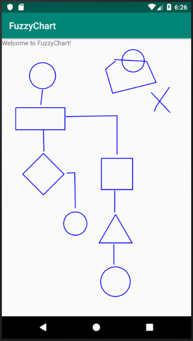
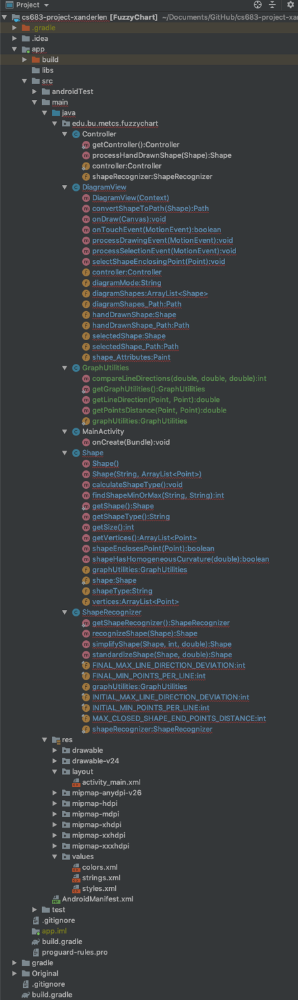

#CS683 Project Assignment - Iteration 4: Project Assignment
###Project Name: FuzzyChart - Student: Xander Le
--------------
## 1. Overview

*(Please give an overview of your project. It should include the motivation, the purpose and the potential users of the proposed application. This can be the same as in your previous document. If you change it from the last iteration, please make a note.)*

1. **Summary**

	The Overview and requirements have not changed since the last assignment and is summarized here.

	My app is a simple flowcharting program called FuzzyChart which takes hand-drawn shapes and transforms them to the closest matching standard geometric shapes (circles, squares, triangles, etc.). The purpose of this app is to provide a simple way to quickly capture design ideas; potential users are software developers, system designers and analysts, engineers, and anyone who simply wants to quickly sketch out their ideas using a flow diagram.
	
## 2. Requirement Analysis and Testing

*(For each requirement you have worked on in this iteration, please give a detailed description, completion status (completed, or partially completed) and show the testing results if completed or partially completed, such as screenshots of the application screens or log info. Please also specify if this requirement is a new requirement or a requirement you had started in previous iterations.)*

The status of the requirements is as follows:

1. **Requirement E1 - Hand-drawn Shapes:** (This is a previously-stated requirement.) The app shall accept hand-drawn shapes input from the user.
	* **Status:** Completed.
	* **Description:** This has been tested and works correctly.
	* **Results:** Sample flowcharts are shown in the next section.
2. **Requirement E2 - Shape Recognition:** (This is a previously-stated requirement.) Right after each shape is drawn, the app shall interpret and translate it to the geometric shape that most closely matches it, then replace the hand-drawn shape with the translated shape. At a minimum the app will recognize the following six geometric shapes: circle, oval, square, rectangle, triangle, diamond.
	* **Status:** Completed.
	* **Description:** This has been completed and works correctly.
	* **Results:** Below are two screenshots of a flowchart - the first shows hand-drawn shapes with shape recognition turned off; the second shows the flowchart after shape recognition has been turned on and the shapes converted.
	*           

3. **Moving** (This is a previously-stated requirement.) The user shall be able to select and move any shape from one position to another anywhere on the diagram. Any connecting lines between them will be moved and adjusted as necessary to maintain the connection.
	* **Status:** In progress.
	* **Description:** I am currently testing out this feature. I have done some refactoring of the code which resulted in two modes of operation in the DiagramView class - Drawing and Selection. The Drawing mode is completed and allows the user to draw shapes. The Selection mode will allow the user to select a shape by clicking on or near it, after which they can drag the shape to another location.
	* **Results:** At this moment the code is not runnable because the refactoring is not quite completed, but I expect it to be running and working shortly.
 
4. **Other requirements**: At this point I am on track to implement all of the Essential Features and at least some of the Desirable Features for the final release.

## 3. Design and Implementation

(Please describe Android components and features you have used in this iteration to implement the above requirements in your application. For each feature you used, provide a brief description and supporting evidences, such as sample code, log info, or screenshot(s) of execution results. Please specify mapped requirements and files in your project.)

I have added a GraphUtilities class and moved some of the methods that were in the ShapeRecognizer class into it, simplifying ShapeRecognizer so that it only has three methods in it now devoted to simplifying and recognizing shapes. It uses the utility methods in the GraphUtilities class to aid in performing its functions. Other methods that were in ShapeRecognizer having to do with Shape functions have been moved into the Shape class. I have also done some code refactoring in the methods contained in the Shape and ShapeRecognizer classes to simplify them.

##4. Project Structure

(Please provide a screenshot(s) of your project structure, which should show all the packages, java files and resource files in your project. You should also highlight any files/packages you have changed, added/deleted in this iteration comparing with the previous iteration).

The following shows a screenshot of the project structure for this iteration, with all relevant folders and files shown:

## 5. Timeline

*(Please provide a detailed plan/description to specify when the above requirements and android features will be/are implemented. This should be updated in every iteration.)*

|Iteration | Application Requirements (E/D/O) | Android Components and Features| 
|---|---|---|
|1|E1 and E2 (completed)|Activities, Graphics, Multithreading |
|2|E3 to E6 (partially completed)|Activities, Graphics, Multithreading|
|3|E3 to E6 (partially completed)|Activities, Graphics, Multithreading|
|4|E3 to E6, D1 to D3|Activities, Graphics, Multithreading, Files|
|5|O1 to O5 *(As many of these will be implemented as time permits.)*|Activities, Graphics, Multithreading|

## 6. References

*(Please list all your references here)*
