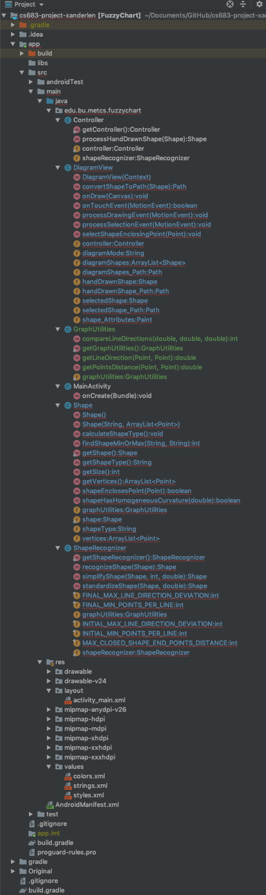

#CS683 Project Assignment - Final Release
###Project Name: FuzzyChart - Student: Xander Le
--------------
## 1. Overview

*(Please give an overview of your project. It should include the motivation, the purpose and the potential users of the proposed application. This can be the same as in your previous document. If you change it from the last iteration, please make a note.)*

The Overview and requirements are stated here; they have not changed since the last iteration.
	
* My app is a flowcharting program called FuzzyChart which allows the user to draw flowcharting diagrams by drawing basic shapes and connecting them together. The user is able to input shapes by drawing them freehand and having the app transform them to the closest matching geometric shapes (circles, squares, triangles, etc.).

* The purpose of this app is to provide a simple way to quickly capture design ideas for a software program or any engineering project that might benefit from having a flow diagram. Potential users of this app are software developers, system designers and analysts, engineers, and anyone who simply wants to quickly sketch out their ideas for their project using a flow diagram.
	
* I wanted to be able to create a program that utilized machine learning, and originally I intended to use TensorFlow for the shape recognition. However, during the course of development I found this was difficult and time-consuming to implement, so I changed my strategy and ended up developing my own algorithms, which worked out quite well.
	
## 2. Related Work

*(Please describe any similar applications that you have found through the online research, and the differences between your application and those applications. This is based on your project proposal. You can make any adjustment as needed.)*

* There are many flowcharting applications available of different qualities and capabilities. Some are very sophisticated, having hundreds of different shapes and many different types of connections. Many use templates that can be customized and expanded on. The more full-featured ones usually have a relatively steep learning curve to be able to get the most out of them. Three well-known of these full-featured apps are Microsoft Visio [1], OmniGraffle [2] and Lucidchart [3]. There are also many simpler and less-capable apps that are low-cost or free.

* My app is intended to be in the low-cost or free category, yet still have enough capability to provide an adequate tool for basic flowcharting needs. One of the main differentiating features of my app will be ease of use. My goal is to make it very intuitive so that the user can start using it right away with minimal or no instructions.
	
## 3. Requirement Analysis and Testing

*(For each requirement you have worked on in this iteration, please give a detailed description, completion status (completed, or partially completed) and show the testing results if completed or partially completed, such as screenshots of the application screens or log info. Please also specify if this requirement is a new requirement or a requirement you had started in previous iterations.)*

The status of the requirements is as follows:

1. **Requirement E1 - Hand-drawn Shapes:** (This is a previously-stated requirement.) The app shall accept hand-drawn shapes input from the user.
	* **Status:** Completed.
	* **Description:** This has been tested and works correctly.
	* **Results:** Sample flowcharts are shown in the next section.
2. **Requirement E2 - Shape Recognition:** (This is a previously-stated requirement.) Right after each shape is drawn, the app shall interpret and translate it to the geometric shape that most closely matches it, then replace the hand-drawn shape with the translated shape. At a minimum the app will recognize the following six geometric shapes: circle, oval, square, rectangle, triangle, diamond.
	* **Status:** Completed.
	* **Description:** This has been completed and works correctly.
	* **Results:** Below are two screenshots of a flowchart - the first shows hand-drawn shapes with shape recognition turned off; the second shows the flowchart after shape recognition has been turned on and the shapes converted.
	*           

3. **Moving** (This is a previously-stated requirement.) The user shall be able to select and move any shape from one position to another anywhere on the diagram. Any connecting lines between them will be moved and adjusted as necessary to maintain the connection.
	* **Status:** In progress.
	* **Description:** I am currently testing out this feature. I have done some refactoring of the code which resulted in two modes of operation in the DiagramView class - Drawing and Selection. The Drawing mode is completed and allows the user to draw shapes. The Selection mode will allow the user to select a shape by clicking on or near it, after which they can drag the shape to another location.
	* **Results:** At this moment the code is not runnable because the refactoring is not quite completed, but I expect it to be running and working shortly.
 
4. **Other requirements**: At this point I am on track to implement all of the Essential Features and at least some of the Desirable Features for the final release.

## 4. Design and Implementation

(Please describe Android components and features you have used in this iteration to implement the above requirements in your application. For each feature you used, provide a brief description and supporting evidences, such as sample code, log info, or screenshot(s) of execution results. Please specify mapped requirements and files in your project.)

I have added a GraphUtilities class and moved some of the methods that were in the ShapeRecognizer class into it, simplifying ShapeRecognizer so that it only has three methods in it now devoted to simplifying and recognizing shapes. It uses the utility methods in the GraphUtilities class to aid in performing its functions. Other methods that were in ShapeRecognizer having to do with Shape functions have been moved into the Shape class. I have also done some code refactoring in the methods contained in the Shape and ShapeRecognizer classes to simplify them.

## 5. Project Structure

(Please provide a screenshot(s) of your project structure, which should show all the packages, java files and resource files in your project. You should also highlight any files/packages you have changed, added/deleted in this iteration comparing with the previous iteration).

The following shows a screenshot of the project structure for this iteration, with all relevant folders and files shown:

## 6. Timeline

*(Please provide a detailed plan/description to specify when the above requirements and android features will be/are implemented. This should be updated in every iteration.)*

|Iteration | Application Requirements (E/D/O) | Android Components and Features| 
|---|---|---|
|1|E1 and E2 (completed)|Activities, Graphics, Multithreading |
|2|E3 to E6 (partially completed)|Activities, Graphics, Multithreading|
|3|E3 to E6 (partially completed)|Activities, Graphics, Multithreading|
|4|E3 to E6, D1 to D3|Activities, Graphics, Multithreading, Files|
|5|O1 to O5 *(As many of these will be implemented as time permits.)*|Activities, Graphics, Multithreading|

## 7. Future Work

## 8. Project Links

## 9. References

[1] [Microsoft Visio](https://products.office.com/en-us/visio/flowchart-software)

[2] [OmniGraffle](https://www.omnigroup.com/omnigraffle)

[3] [Lucidchart](https://www.lucidchart.com/pages/)