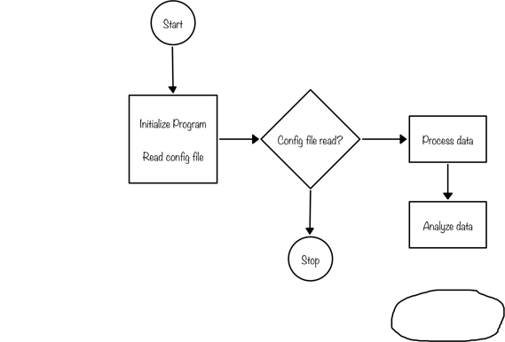

#CS683 Project Assignment - Iteration 0: Project Proposal
###Project Name: FuzzyChart - Student: Xander Le###
-

## 1. Overview

*(Please give an overview of your project. It should include the motivation, the purpose and the potential users of the proposed application)*

My app will be a flowcharting program called FuzzyChart which will allow the user to draw flowcharting diagrams by drawing basic shapes and connecting them together. The user will be able to input shapes by drawing them freehand and having the app transform them to the closest matching geometric shapes (circles, squares, triangles, etc.).

The purpose of this app is to provide a simple way to quickly capture design ideas for a software program or any engineering project that might benefit from having a flow diagram. Potential users of this app are software developers, system designers and analysts, engineers, and anyone who simply wants to quickly sketch out their ideas for their project using a flow diagram.

One of the main reasons I chose this application is so that I can utilize my knowledge of machine learning that I gained from the last class that I took. There I used machine learning to make a calculator app that accepted hand-written digits as input.

## 2. Related Work

*(Please describe any similar applications that you have found through the online research, and the differences between your application and those applications.)*

There are many flowcharting applications available of different qualities and capabilities. Some are very sophisticated, having hundreds of different shapes and many different types of connections. Many use templates that can be customized and expanded on. The more full-featured ones usually have a relatively steep learning curve to be able to get the most out of them. Three well-known of these full-featured apps are Microsoft Visio [1], OmniGraffle [2] and Lucidchart [3]. There are also many simpler and less-capable apps that are low-cost or free.

My app is intended to be in the low-cost or free category, yet still have enough capability to provide an adequate tool for basic flowcharting needs. One of the main differentiating features of my app will be ease of use. My goal is to make it very intuitive so that the user can start using it right away with minimal or no instructions.

## 3. Proposed High level Requirements

### Essential Features: 

*(Please describe all essential features that your application will have. For each feature, please give a feature title, a brief description, possible acceptance tests, as well as one or multiple mock-up screen(s) if applicable.)* 

1. **Hand-drawn Shapes:** The app shall accept hand-drawn shapes input from the user.

2. **Shape Recognition:** Right after each shape is drawn, the app shall interpret and translate it to the geometric shape that most closely matches it, then replace the hand-drawn shape with the translated shape. At a minimum the app will recognize the following six geometric shapes: circle, oval, square, rectangle, triangle, diamond.

3. **Moving:** The user shall be able to select and move any shape from one position to another anywhere on the diagram. Any connecting lines between them will be moved and adjusted as necessary to maintain the connection.

4. **Deleting:** The user shall be able to select and delete any shape or line. If a shape is deleted, all connections to it will also be deleted.

5. **Shape Connectors:** The user shall be able to connect any two shapes together with a straight line by drawing a line between them. Each end of the line must touch a shape to form a connection, and the line will have an arrow at one end corresponding to the direction the line was drawn in.

6. **Labels:** The user shall be able to apply a label to any shape by selecting it and typing the desired text.

		Acceptance tests: (No acceptance tests are defined at this time.)
		
Below is a sample flowchart showing a freeform shape that has been drawn but not yet interpreted by the app:

### Desirable Features

*(Please describe all desirable features that your application would like to have. For each feature, please give a feature title, a brief description, possible acceptance tests, as well as one or multiple mock-up screen(s) if apply.)*

1. **Resizing:** The user shall be able to resize any shape. At a minimum, the user shall be able to resize the shape and maintain its proportionality. (The capability to resize non-proportionally may be added later).

2. **Replacing:** The user shall be able to replace any shape with any other shape while maintaining any line connections to it.

3. **Saving and Loading:** The user shall be able to save a flow chart to file and load it back.

### Optional Features

*(Please describe all optional features that your application would like to have if the time permits. For each feature, please give a feature title and a brief description.)*

1. **Copying and Pasting:** The user shall be able to copy and paste shapes anywhere on the diagram.

2. **Freehand Shapes:** The user shall be able to draw a freehand shape without it being translated to a standard geometric shape. The shape will be treated like any other geometric shape as far as editing features are concerned (connecting lines, copying/pasting, resizing, etc.)

3. **Line Labels:** The user shall be able to apply labels to line connections in the same way they can to shapes.

4. **Floating Text:** The user shall be able to apply text labels anywhere on the flow chart without it being attached to any shape.

5. **Component Attributes:** The user shall be able to change the following attributes for shapes, connector lines and text: Line weight, Line color, Fill color, Font, Font style, Font color.

## 4. Android Components and Features To Be Used

*(Please specify basic android components and features your application plans to have. Here is a list of components/features you can use: activities, databases and/or content providers, files, settings (through sharedpreferences), services, broadcast receivers, multi-threaded, multi-process, animation, graphics, remote server connection, GPS, microphone, camera, or other sensors, google APIs, etc. For each android component/feature, briefly describe how this can be fit into your application).*

1. **Activities:** The main activity of this app will define and display the drawing area where the flowchart will be drawn. A second activity will be used to save and load the flowcharts. A third activity will be used to set flowchart options.

2. **Machine Learning** Java classes and methods will be written to implement machine learning algorithms which will be used to recognize hand-drawn shapes. Google's TensorFlow APIs will be used.

3. **Files:** Files will be used to save and load flowcharts.

4. **Multithreading:** Multiple threads will be used. The main thread will be used to update the display and other threads will be used to perform all other non-display functions.

5. **Graphics:** Graphics will be used to draw and display the various GUI components - shapes, connectors and text.

## 5. Timeline

*(Please provide a detailed plan/description to specify when the above requirements and android features will be/are implemented. This should be updated in every iteration.)*

|Iteration | Application Requirements (E/D/O) | Android Components and Features| 
|---|---|---|
|1|E1 and E2|Activities, Graphics, Machine Learning, Multithreading |
|2|E3 and E4|Activities, Graphics, Multithreading|
|3|E5 and E6|Activities, Graphics, Multithreading|
|4|D1 to D3|Activities, Graphics, Multithreading, Files|
|5|O1 to O5 *(As many of these will be implemented as time permits.)*|Activities, Graphics, Multithreading|

## 6. References

*(Please list all your references here)*

[1] [Microsoft Visio](https://products.office.com/en-us/visio/flowchart-software)

[2] [OmniGraffle](https://www.omnigroup.com/omnigraffle)

[3] [Lucidchart](https://www.lucidchart.com/pages/)